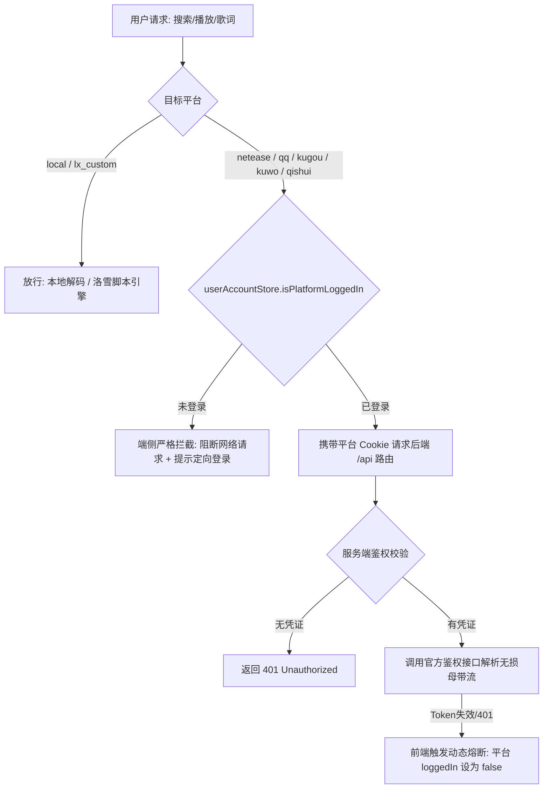

# 网络音乐平台登录链路管控 (Platform Login Link Guard) 实施计划与架构设计

> 分支: `feature/platform-login-link-guard`  
> 目标: 默认不将未登录的网络音乐平台开放链路，只有在完成登录后才走这条链路，登录哪个可以走哪个，其他默认关闭不走。

---

## 1. 核心需求与设计决议（6 轮访谈落地）

1. **全链路严格管控**：
   未登录平台（网易云、QQ 音乐、酷狗、酷我、汽水）的【音频直链解析、搜索结果派发、歌词嗅探、封面嗅探、云端歌单同步】默认彻底关闭，不向未鉴权公网 API 发起无效流量。
2. **免登录音源自主受控**：
   - 本地母带（Local Master）：默认永久开放，不依赖任何网络登录。
   - 洛雪扩展源（LX Custom Script）：独立受控于用户启用的自定义脚本开关。
   - 离线 IndexedDB 缓存：此前下载/缓存的音频数据可永久正常离线播放。
3. **严格源隔离**：
   歌曲标记属于哪个平台就只能走哪个平台。未登录该平台时直接拦截并定向弹出该平台的登录面板，绝不跨源串流到其他平台。
4. **端侧 + 服务端双层门禁**：
   - 前端：`MultiSourceResolver` 与 `searchStore` 在请求发起前做严格门禁拦截。
   - 服务端：`/api/*` 接口严格校验凭证 Header/Cookie，无凭证直接返回 401，杜绝公网爬虫与第三方未鉴权直连泄露。
5. **双重判定 + 动态熔断**：
   内存状态以 store 的 `loggedIn` 为准，并在请求捕获到鉴权失效（如 Cookie 过期/401）时立即自动将该平台链路锁定关闭，同时弹出轻提示引导重新扫码/绑定。
6. **UI 体验全面升级**：
   - 音源管理开关未登录时呈加锁禁用态（附带「需登录解锁」提示）。
   - 搜索多源独立 Tab 显示专属未连接引导卡片。
   - 全局搜索静默过滤未登录源。
   - 点击未登录单曲播放时优雅拦截并弹出定向登录面板。

---

## 2. 详细改造范围与文件结构

---

## 3. 验收标准

- [ ] 未登录任何平台时，搜索仅包含本地与已启用的洛雪脚本，不向各平台发送请求。
- [ ] 播放未登录平台的单曲时，播放器不报错、不崩溃，弹出精美提示与一键登录按钮。
- [ ] 登录平台 A（如网易云）后，平台 A 链路立即开放，其余未登录平台继续保持关闭。
- [ ] 登出平台 A 后，平台 A 链路立即锁闭。
- [ ] 单元测试全绿通过，生产构建编译 0 报错。
